# Estudia geografia

A small offline web app for learning school geography in Catalan: where places are and
what their capitals are. It is organised in **content packs**, and each learner picks the
one their exam covers.

**Use it:** https://cristianllamas.github.io/comarques/ — on a phone, open it in Chrome
and choose *Afegeix a la pantalla d'inici*. It installs as **Geografia** and works without
a connection once opened. Each device keeps its own progress.

| Pack | Places | Asks | Questions |
|---|---|---|---|
| **Comarques i capitals** | the comarques of Catalunya (42, or 43 with Lluçanès) | where it is, its capital | 84 |
| **Comarques** | the same map | where it is | 42 |
| **Comunitats autònomes** | 17 comunitats + Ceuta and Melilla | where it is, its capital | 34 |
| **Unió Europea** | the 27 member states | where it is, its capital | 53 |
| **Àfrica** | 54 states + the Sàhara Occidental | where it is, its capital | 108 |
| **Amèrica del Nord i Central** | 23 states + Groenlàndia and Puerto Rico | where it is, its capital | 47 |
| **Amèrica del Sud** | 12 states + the Guaiana Francesa | where it is, its capital | 26 |
| **Àsia** | 49 states + Palestina and Taiwan (Rússia, Turquia, Xipre, the Caucasus, Kazakhstan and Egipte included) | where it is, its capital | 100 |
| **Oceans** | the five oceans | where it is | 5 |
| **Mars i golfs** | 23 seas and gulfs + the Caspi | where it is, which ocean it belongs to | 47 |

The picker groups them under *Catalunya*, *Espanya*, *Europa* and *Món*.

A capital is not asked where the question would answer itself (Luxemburg, Madrid,
Múrcia, Mèxic, Singapur…) or where there is none (Ceuta and Melilla are their own city);
it still appears on the card. Where the capital is disputed or split (Bolívia, Sud-àfrica,
Israel, Palestina, Tanzània…) every answer is accepted and the card explains why there is
more than one. Places that are not independent countries (Groenlàndia, Puerto Rico, the
Guaiana Francesa) say so on their card.

---

## The screens

### Choosing a pack

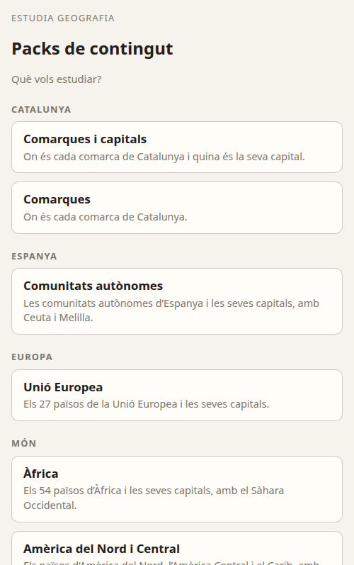

The first screen on a new device. Each pack keeps its **own progress**, so switching back
and forth loses nothing; the picker shows how many sessions have been done in each.

The app remembers the last pack and opens straight into it next time. To switch, use
**☰ Packs de contingut** in the header of the home screen.

<br clear="right">

### Home

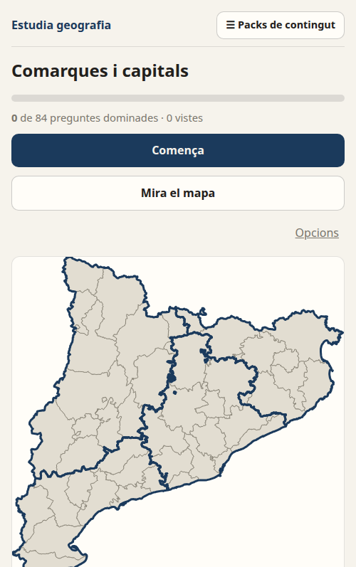

- **The header** — the app name and **☰ Packs de contingut**, which leads back to the
  picker. The pack sits above everything else on the screen, so it lives up here.
- **Progress** — how many questions are *dominades* (well known: answered right on
  several spaced occasions), how many have been seen, and how many *es resisteixen*
  (missed three or more times).
- **Comença / Continua** — starts a study session (below).
- **Mira el mapa** — the free-study map.
- **Opcions** — the pack's settings.

<br clear="right">

### A session: Repàs, then Recorda

Every session has two phases, and they always work on **different places**.

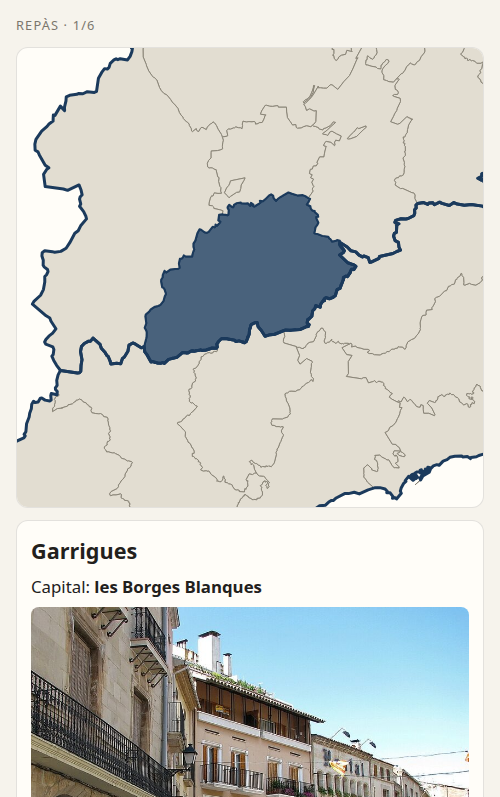

**1 · Repàs** — six cards, nothing to answer. Each shows the place lit up on the map, its
name, its capital (if the pack asks capitals), a landmark photo with its caption, a short
memory hook, and context such as the província.

What is shown here comes back as a question in a *later* session, never the same one:
testing something seconds after seeing it measures short-term memory, not learning.

<br clear="right">

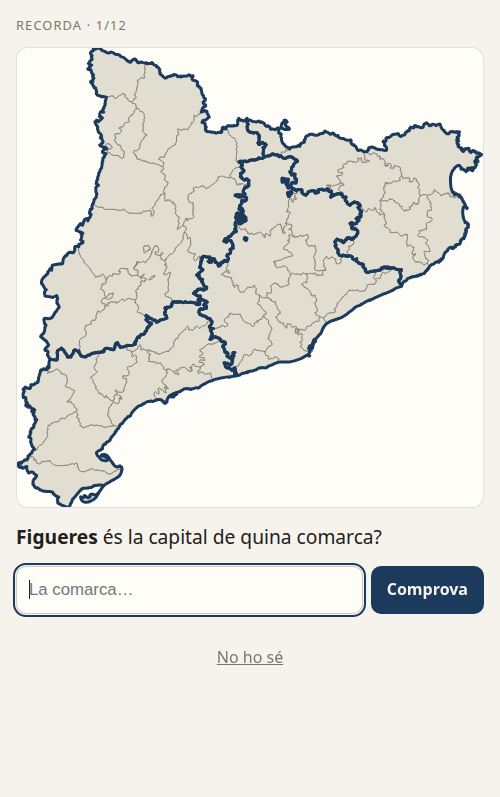
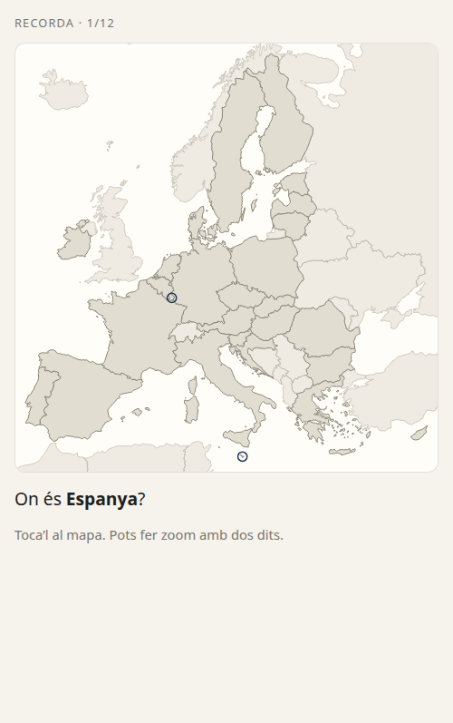

**2 · Recorda** — twelve questions (fewer in a small pack), of these kinds:

| Kind | Example |
|---|---|
| tap it on a blank map | *On és Hongria?* |
| name the highlighted shape | *Quina comarca és la destacada?* |
| give the capital | *Quina és la capital del Segrià?* |
| name the place from its capital | *Toledo és la capital de quina comunitat autònoma?* |
| say which ocean a sea belongs to (*Mars i golfs*) | *A quin oceà pertany el mar Negre?* |

Pinch to zoom on the map; the tiniest places (Malta, Luxembourg, Ceuta, Melilla, the
Antilles, the golf Pèrsic) have a ring around them that can be seen and tapped at full
size.

<br clear="right">

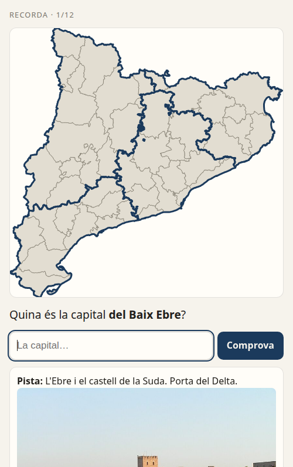
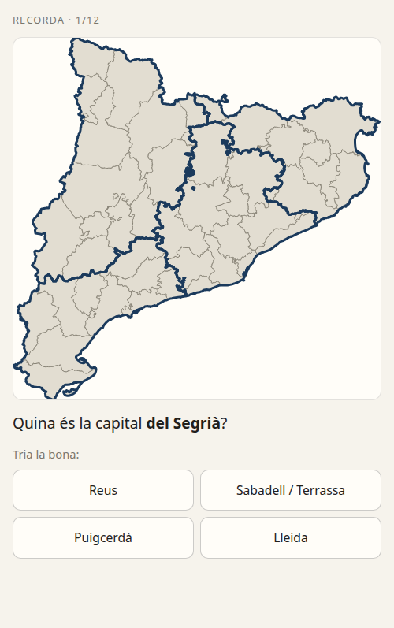

**A wrong answer is never a dead end.** Typed answers climb down step by step:

1. a **hint** — the memory hook and the photo
2. the **first letter**: *L _ _ _ _ _*
3. **four options** to choose from

so the effort of remembering is always made, and it always ends with the right answer
on screen. Accents, capitals, articles and small typos are forgiven (*vitoria*,
*la valletta*, *Zaragoza* all count), but never enough to let a different place through.
A missed question comes back once more at the end of the same session.

<br clear="right">

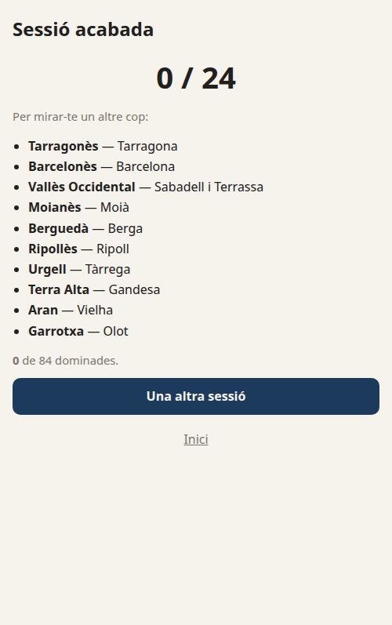

**The summary** shows the score, lists everything that was missed with its answer, and
offers another session.

**How often:** 3–4 short sessions a day. The app decides what to show: new places mixed
with ones that are due again, at growing intervals (20 minutes, 2 hours, 8 hours, then
days). A place answered wrong drops back and comes round sooner. New places are
introduced in a random order that stays fixed for that device.

<br clear="right">

### Mira el mapa — free study

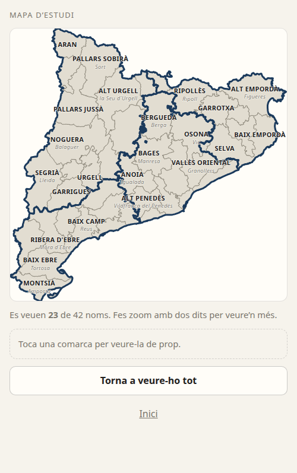
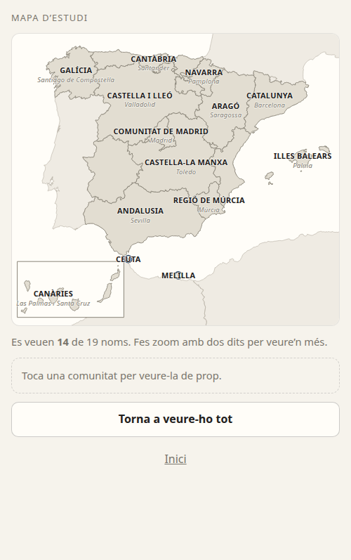
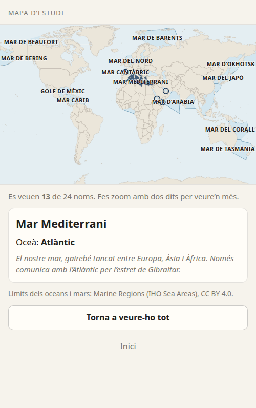

The whole map with names (and capitals) written on the shapes, to explore at one's own
pace. Not every name fits on a phone at once, so the biggest places are labelled first and
the rest appear as you zoom in; the counter says how many are showing. Tap any place to
see its card.

Browsing here deliberately **does not count** as practice: looking is not remembering,
and counting it would make places look learned when they are not.

<br clear="right">

### Opcions

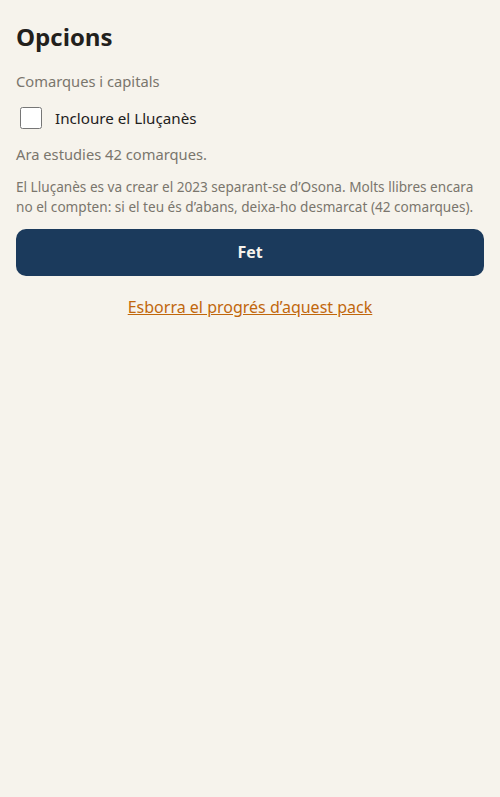

Settings belong to the current pack:

- **Incloure el Lluçanès** (comarques packs only). Lluçanès split from Osona in 2023 and
  many textbooks still list 42 comarques, so it is **off** by default and Osona is drawn
  with Lluçanès inside it. Switch it on if the syllabus has 43.
- **Esborra el progrés d'aquest pack** — starts the pack over. Other packs are untouched.

<br clear="right">

---

## Content

Correct content matters more than anything else here: this teaches facts for exams.

- **Comarques:** official boundaries, names and capitals from the Institut Cartogràfic i
  Geològic de Catalunya, via [Dades Obertes de Catalunya](https://analisi.transparenciacatalunya.cat).
  The build checks there are 43 comarques and the per-província counts match the official
  table (Barcelona 13, Girona 8, Lleida 12, Tarragona 10). Cerdanya, which straddles
  Girona and Lleida, is officially Girona and the card says it straddles both.
- **Comunitats autònomes, Unió Europea and the continents:** official boundaries from
  [Eurostat GISCO](https://ec.europa.eu/eurostat/web/gisco). Catalan names, capitals and
  articles are written by hand (Optimot / IEC forms) and checked against the geometry by
  the build. Canàries are drawn in a box at the bottom left, as on most maps of Spain;
  overseas territories are left off the EU map. On the continents, disputed areas are
  drawn with the country that administers them (Caixmir with India, Essequibo with
  Guyana) and the card mentions the dispute; Hawaii is left off the America map.
- **Oceans and seas:** the IHO's sea areas, from
  [Marine Regions](https://www.marineregions.org) (CC BY 4.0, credited on the study map);
  an ocean is all of its seas, and each sea's ocean follows the IHO's grouping (the
  Mediterrani belongs to the Atlàntic). The Caspi, a closed sea, comes from Natural Earth.
  These two maps use a cylindrical projection (Gall stereographic), chosen so the world is
  tall enough to read on a phone; as on most classroom wall maps, Greenland, the Arctic
  and Antarctica look bigger than they really are.
- **Two cases with no official capital:** the País Basc and Castella i Lleó have no
  capital set by law. The app uses the seats of government, Vitòria and Valladolid (the
  usual textbook answer), and the hook says so.
- **Memory hooks:** short, concrete facts written by hand for every place.
- **Photos:** the comarques photos were supplied by the family. The EU and comunitats
  photos are landmarks chosen and reviewed by hand; the continents' were chosen by hand
  and checked on contact sheets without the owner's review. All come from
  [Wikimedia Commons](https://commons.wikimedia.org). Each shows its caption — which
  always names the city, so the Alhambra on the Spain card is never mistaken for Madrid —
  and the author and licence, linked to the original.

---

## For maintainers

**[ARCHITECTURE.md](ARCHITECTURE.md)** explains how it is built and why: the layers,
the data model, the map pipeline, and the decisions and traps that each cost a bug.
`CLAUDE.md` is the short version for AI coding sessions.

```bash
cd docs && python3 -m http.server 8000   # run locally, then open localhost:8000

node build/sim-scheduler.mjs             # simulate a week of study for every pack
node build/e2e.mjs                       # drive the real app in headless Chrome
SHOTS=screenshots node build/e2e.mjs     # …and regenerate the screenshots in this README
```

No dependencies: no npm, no framework, no bundler. Pushing to `main` publishes the site.
The tag `pre-packs` marks the last comarques-only version, and `pre-world` the last
version before the continents, oceans and seas, should a rollback ever be needed.
